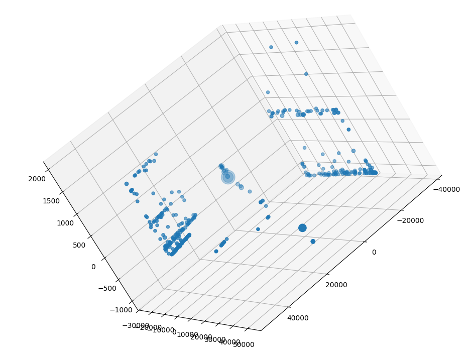
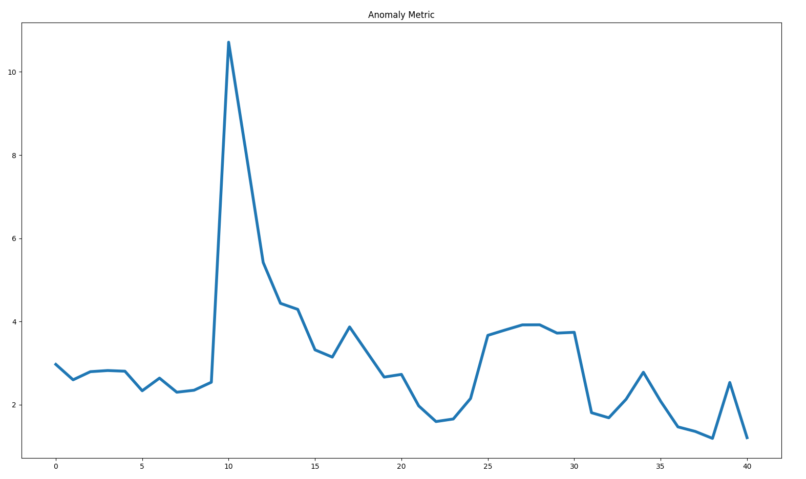

# Real Time Anomaly Detection with PCA
This repository implements work from Shyu et al.  
Shyu M-L, Chen S-C, Sarinnapakorn K, Chang L. A novel anomaly detection scheme
based on principal component classifier. In: IEEE foundations and new direc-
tions of data mining workshop, in conjunction with ICDM'03, 2003. p. 171–9.  
 
For results and information on how this works, see the referenced work and the attached write up at [Report.pdf](Report.pdf).  

# User manual
## Requirements
A valid python environment is required. To ensure all dependencies are installed, run `pip install -r requirements.txt`. It is recommended to run this within a venv.  
 
This tool scans the network on a selected interface and requires elevated priveleges to run. On linux, this can be done with `sudo ./venv/bin/python main.py`.  
## Default Execution
This program executes in two phase: training, and anomaly detection. By default, the detection phase is not executed.  
 
To run this program with default configuration, run `sudo ./venv/bin/python main.py`  
 
The program will prompt the user to select an interface to sniff on. This tool only supports selection of one interface at a time. Available interfaces will be listed and the user is expected to enter the index of the interface they would like to use, or press enter to select the default interface. For most purposes, the default interface should be used.  
 
After an interface is selected, a model will begin training on collected network traffic and a status line will be printed showing the time the model has spent training and the total number of packets that have been collected so far. The user can press `q` at any time to stop training the model.  
 
Once training has stopped, the explained variance of the 3 principal components is printed in console, and 2 plots are produced. The first plot is a 3d scatter plot showing the transform performed by the PCA of some random sampling of training data. Points that are repeated in the sample are plotted with a larger size. *Figure 1* is an example output of this plot. The second plot is a line chart of the mean anomaly metric per batch over the training time. The default batch size is 100 packets. A higher score means there were more or more significant anomalies within that batch. *Figure 2* is an example output of this plot.  
#### *Figure 1*
  
#### *Figure 2*
  
## Options
This tool uses various command line options to control training and anomaly detection phases. Options controlling the training phase are aliased to lower case letters, while options controlling the anomaly detection phase are aliased to upper case letters.  
#### Training options
| Option name | Option alias | Data type | Description |
| --- | --- | --- | --- |
| --interface | -i | string | The name of the interface to sniff on. If specified, the user will not be prompted to choose the interface |
| --timeout | -t | int | Number of seconds to train for. Replaces the "quit on q" prompt |
| --load-and-train | -l | file path | Load in a pickled 3 component PCA and continue training it |
| --output-model | -o | file path | When training is finished, store the model as a pickle file |
| --continue | -c | bool / NA | If this option is specified, the model trained in the training phase will be passed on to the detection phase |

#### Detection options
| Option name | Option alias | Data type | Description |
| --- | --- | --- | --- |
| --interface | -i | string | The name of the interface to sniff on. If specified, the user will not be prompted to choose an interface |
| --load-model | -L | file path | Load in a pickled model and begin detecting anomalies. Mutually exclusive with `--continue` |
| --outlier-threshold | -C | float >0 | Report an anomaly if a packets anomaly metric exceeds this value. Default: 3 |
| --output-anomalies | -O | file path | If specified, any anomalous packets will be printed to a log file in a readable format |

* Note: The dection phase is only executed if `-L` or `-c` are specified. The two options control what model is used for detection and are mutually exclusive.

